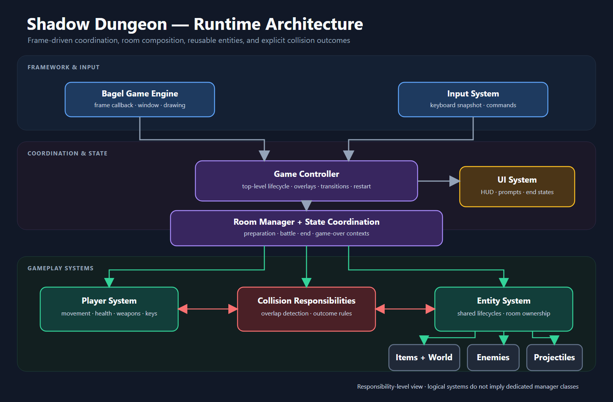
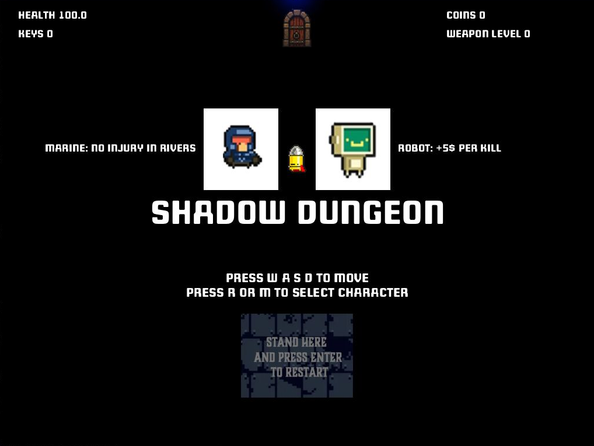

# Shadow Dungeon

Shadow Dungeon is a 2D room-based action game developed as a software modelling and design project. The implementation explores how object-oriented boundaries, polymorphic entities, state-oriented room flow, collision rules, and configuration-driven content can work together inside a real-time game loop.

This public repository is a portfolio case study rather than a distributable copy of the assessed submission. It documents the architecture, engineering decisions, challenges, and lessons learned while intentionally excluding source code and course-provided material.

## Project Overview

**Purpose:** Apply software modelling and object-oriented design techniques to an interactive system with many stateful objects and frame-by-frame interactions.

**Technologies:** Java, Bagel game framework, Maven, object-oriented programming, properties-based configuration.

**My contribution:** I implemented the gameplay architecture and systems that coordinate player control, enemies, combat, projectiles, room transitions, item interactions, upgrades, and game progression. I also structured reusable abstractions for related entity types and separated presentation, configuration parsing, and room-specific behaviour. Framework code and course-provided materials are not represented as my original work and are not included here.

## Features

- **Player system:** Movement, directional facing, character selection, health, currency, keys, weapon progression, and cooldown-controlled shooting.
- **Enemy system:** Multiple enemy variants sharing common lifecycle, damage, reward, activation, and firing behaviour while retaining specialised actions.
- **Combat mechanics:** Player and enemy attacks, contact damage, destructible objects, rewards, healing, and weapon upgrades.
- **Projectile system:** Friendly and hostile projectiles with normalised movement, damage values, collision state, and safe lifecycle removal.
- **Collision handling:** Axis-aligned overlap checks across players, enemies, projectiles, doors, hazards, obstacles, containers, and room boundaries.
- **Room and state management:** Preparation, combat, completion, and end states with controlled transitions and room-specific object ownership.
- **Game progression:** Locked encounters, enemy activation, key drops, treasure interactions, currency rewards, a store, and win/restart flows.

## Technical Highlights

### Object-oriented design

Related enemy and projectile variants share abstract base behaviour and expose focused extension points for specialised actions. A common collision contract allows otherwise unrelated objects to participate in overlap checks without requiring a single deep inheritance tree.

One especially useful structure resembles the **Template Method** pattern: common enemy update rules are fixed in one lifecycle operation, while subclasses supply their enemy-specific action. The room system is **state-oriented**, although it is not presented as a formal State-pattern implementation because transitions are coordinated centrally rather than through interchangeable state objects.

### Encapsulation and composition

Entity state such as health, position, cooldowns, rewards, and collected status is owned by the object responsible for that behaviour. Rooms use composition to own their doors, obstacles, enemies, items, and active projectiles, keeping encounter data local to the room in which it is used.

### Separation of concerns

- The game coordinator handles top-level lifecycle and transitions.
- Room components coordinate the entities active in each environment.
- Entity types own local movement, damage, drawing, and interaction state.
- UI utilities render player statistics and game messages.
- Parsing utilities convert external configuration into runtime data.

This division makes individual concepts easier to reason about, while the retrospective documents where further separation would improve a production version.

### Algorithms and implementation details

- Direction vectors are normalised so aimed projectiles travel at consistent speed regardless of target distance.
- Patrol enemies advance through ordered waypoints to create route-based movement.
- Cooldown counters provide deterministic frame-based firing and attack timing.
- Projectile collections are processed in reverse when removal may occur, avoiding skipped elements during iteration.
- Collision outcomes distinguish allegiance, object type, locked state, destructibility, rewards, and enemy drops.
- Externalised values allow balancing and room layouts to change independently from entity algorithms.

## Architecture Overview

The Bagel engine supplies the frame callback and input snapshot. A game controller coordinates global state and delegates each frame to the active room. The room then updates the player and its composed entities, resolves relevant collisions, applies resulting state changes, and passes display data to the UI layer.

The “Collision System” and “State Management” boxes in the diagram represent logical responsibilities rather than claiming that the original implementation contained classes with those exact names.

See [Architecture Overview](docs/architecture-overview.md) for component responsibilities and runtime flow.

## Design Decisions

- Shared enemy and projectile rules were placed in base abstractions to avoid repeating lifecycle code.
- Composition was used for room contents because a room *contains* entities rather than being a type of entity.
- A small collision interface provided a common capability across unrelated game objects.
- Room-specific controllers kept encounter logic close to the objects they coordinate.
- Configuration-driven values improved balancing flexibility, at the cost of runtime parsing and string-based keys.
- A central controller made the project approachable at assignment scale, but introduced coupling that a larger production game should remove.

The detailed retrospective is available in [Design Decisions](docs/design-decisions.md).

## Challenges and Solutions

### Coordinating object interactions

Projectiles can interact differently with players, enemies, walls, doors, tables, baskets, and room boundaries. The implementation addressed this with a shared overlap contract followed by explicit outcome rules, keeping geometric detection consistent while preserving gameplay-specific consequences.

### Preventing transition-frame errors

A room transition can invalidate assumptions made earlier in the same frame. Update guards stop the previous room from continuing to mutate or draw state after ownership has moved to another room.

### Managing stateful combat

Enemy activation, death, rewards, dropped keys, unlocked doors, and projectile cleanup must occur in a stable order. The update flow separates entity lifecycle steps and removes expired objects safely after collision decisions.

### Keeping related classes understandable

Inheritance captures genuinely shared behaviour, while room composition and utility components prevent every responsibility from accumulating in the main game class. The code-quality review identifies where this separation can be taken further.

## Documentation

- [Architecture Overview](docs/architecture-overview.md)
- [Design Decisions](docs/design-decisions.md)
- [Code Quality Review](docs/code-quality-review.md)
- [Resume Project Description](resume/project-description.md)
- [Screenshot Guidance](assets/screenshots/README.md)

## Screenshot

This application-only crop shows the running game while excluding the window title bar, local paths, student identifiers, submission metadata, configuration files, and source code.

## Future Improvements

- Replace central conditional state switching with a `GameState` abstraction and explicit transition API.
- Separate simulation updates from rendering to improve testability and pause/snapshot behaviour.
- Extract collision resolution and entity lifecycle management from room controllers.
- Replace string-based configuration access with validated, typed configuration objects.
- Add unit tests for movement, collision outcomes, cooldowns, rewards, and state transitions.
- Add integration tests around complete room progression and restart behaviour.
- Profile collision checks and introduce spatial partitioning only if larger levels make it necessary.
- Add accessibility settings, audio, save-state support, additional enemy behaviours, and a sanitised gameplay sequence.

## Public Release Checklist

### Safe to publish

- Original portfolio documentation and engineering retrospective.
- High-level architecture diagrams that do not reproduce implementation code.
- Resume summaries and descriptions of personal contribution.
- Screenshots or demo footage made only from assets that are original or cleared for public use.

### Should remain private

- Complete or partial Java solution files.
- Student ID, submission metadata, generated Git logs, grading information, and submission scripts.
- Assignment specification, marking rubric, starter/skeleton code, and model solutions.
- Course configuration files that reproduce the assessed task or level definitions.
- Original repository history if it exposes submission details or restricted material.

### Requires permission before publishing

- Course-provided sprites, backgrounds, fonts, audio, or other resources.
- Gameplay screenshots or video containing assets without confirmed publication rights.
- Any starter code or framework integration code supplied specifically for the assessment.
- The full solution, even after the subject has concluded.

## Academic Integrity Note

> The complete source code is not publicly available due to university academic integrity requirements. This repository demonstrates the project's architecture, engineering decisions, and implementation experience.

No assignment specification, starter code, submission metadata, student identifier, course script, runtime configuration, or original game asset is included in this repository.
